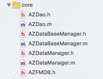

# AZFMDB

u can fast and convenient use sqllite to develop your app.

更加快速 更加便捷的 使用sqllite。

> 在fmdb基础上进行的封装，可以使用间断的sql语句 或者 单一的 model 实现对sqllite3的增删改查。
> —— © Andrew 

 
 
#### 关于

AZFMDB 下包含了FMDB，另外还含有 core 文件夹。内部有：



AZDao 数据模型处理:

```
/**
 *  获取模型的成员变量的类型在sqllite中的类型  并返回键值对（映射）
 * !!! 对像中的成员变量必须是 cocoa 下的类型 不能有基础类型
 *
 *  @param model model实例
 *
 *  @return NSDictionary
 */
+(NSDictionary *)propertySqlDictionaryFromModel:(id)model;


/**
 *  获取一个对象的 成员变量 键值对 （映射）
 * !!! 对像中的成员变量必须是 cocoa 下的类型 不能有基础类型
 *
 *  @param model model实例
 *
 *  @return NSDictionary
 */
+ (NSDictionary *)propertyKeyValueFromModel:(id)model;

```

其中的 

```
+ (NSDictionary *)propertyKeyValueFromModel:(id)model;

```

可以在任何其他的地方，需要将model转为NSDictionary的地方使用（映射）。

###### !!! 注意：model中的成员变量必须是 cocoa 下的类型 ,不能使用基础类型,也不能使用自定义类型。例如：NSInteger CGFloat bool 等 都必须使用 NSNumber 包装一下。


//

//

AZDataManager 继承自 AZDataBaseManager，外部直接使用 AZDataManager 的单例即可。


//

//

#### 说明

> 操作数据库有2种方式，一类是直接使用单一model的方式去操作数据库(以下简称：model)，另一类是使用简短的sql语句去操作数据库（以下简称：brief_sql）。
> 
> 1.model,只能使用单一模型，即模型里的成员变量不能含有其它模型的指针，且成员变量的类型必须是cocoa下的类型，不能为基础类型。
> 
> 2.brief_sql,简短的sql语句，可以让用户输入一些关键的sql语句即可完成对数据库的增删改查。


###### ----------------------------------------------------------------------------
###### 注意事项：

*  ###### user 为 AZUser的实例对象，使用model的方式创建表,表名为：tb_ClassName，如果model中含有NSNumber类型的成员变量，则在init之后建议初始化模型。否则 创建出来的NSNumber类型对应的sqllite的字段类型则为text。

*  ######   model 方式 都有可以指定表名访问的API , 如果不制定 表名，完全适用 model 的方式操作数据表，那么表名则会为：tb_modelname ,如果项目一开始就使用该辅助类，那么建议不制定表名，由内部自动获取。


*  ###### 如果model中含有 NSArray NSMutableArray NSDictionary NSMutableDictionary 那么sql 字段类型会为 text ，存入数据表中是字符串 ，返回的model 中 该类型的对应的值 是字符串，需要再次转化。

###### ----------------------------------------------------------------------------


<br/>
<br/>
<br/>
<br/>
### 1.加入AZFMDB到工程中
将AZFMDB加入你的工程，然后

```
#import "AZFMDB.h"

```

### 2.使用API


##### 2.1 创建数据库

```
[AZDataManager shareManager];
```
指定项目数据库路径为：

```
// 默认db存在的路径
#define DB_PATH_ADDR [NSString stringWithFormat:@"%@/Library/testDB.db",NSHomeDirectory()]

```

正式使用时，建议要去修改工程的制定db的路径。在 AZDataManager.h 中的 line 12 修改即可。


#####2.2 数据库打开 关闭

```
 [[AZDataManager shareManager] open];
 
 [[AZDataManager shareManager] close];
```

#####2.3 创建表

* model 
 
不指定主键

```
 // 创建表
 [[AZDataManager shareManager] createTableModel:user];
	
```

指定主键( 该主键必须在model的成员变量中 且类型应该为NSNumber 包装后的 NSInteger)


```
 // 创建带有主键的表
 [[AZDataManager shareManager] createTableModel:user primaryKey:@"uid"];
	
```


* brief_sql

不指定主键

```

 [[AZDataManager shareManager] createTableWithName:tableName Column:@{@"uid":@"integer",@"name":@"text",@"age":@"integer"}];
 
```

指定主键

```
//主键类型的值为：为“integer” 或则 “INTEGER” ，主键为自增

 [[AZDataManager shareManager] createTableWithName:@"user" primaryKey:@"uid" type:@"integer" otherColumn:@{@"name":@"text",@"age":@"integer"}];
    
```


#####2.4 增 

* model
	
单一增加

```
    
    1: [[AZDataManager shareManager] insertModel:user];
	
	2: [[AZDataManager shareManager] insertModel:lisi inTable:@"tb_user"];
	
```

批量增加

```
	1: [[AZDataManager shareManager] insertModelsByTransaction:@[zhangsan,lisi,lisi,zhangsan]];
	 
	2: [[AZDataManager shareManager] insertModelsByTransaction:@[zhangsan,lisi,lisi,zhangsan] inTable:@"tb_user"];
	 
```


* brief_sql

单一增加

```
   [[AZDataManager shareManager] insertRecordWithColumns:@{
                                                          @"name":@"zja",
                                                           @"sex":[NSNumber numberWithBool:YES],
                                                           @"age":[NSNumber numberWithInt:29]
                                                          } toTable:@"tableName"];

```

批量增加

```
	[[AZDataManager shareManager] insertRecordByTransactionWithColumns:@[
                                                                        @{
                                                                            @"name":@"zja",
                                                                            @"sex":[NSNumber numberWithBool:YES],
                                                                            @"age":[NSNumber numberWithInt:29]
                                                                            },..
                                                                        ] toTable:@"tableName"];

	 
```


#####2.4 删

* model

删除某一个记录

```
  1:[[AZDataManager shareManager] removeOneModel:lisi];
  
  2:[[AZDataManager shareManager] removeOneModel:lisi inTable:@"tb_user"];
  

```
删除所有

```
  1: [[AZDataManager shareManager] removeAllModel:[AZUser class]];
  
  2: [[AZDataManager shareManager] removeAllModel:[AZUser class] inTable:@"tb_user"];
```


* brief_sql


删除某一个记录

```
   [[AZDataManager shareManager] removeRecordWithCondition:@"where age='1'" fromTable:[AZDao tableNameByClassName:[AZUser class]]];

```
删除所有

```
  [[AZDataManager shareManager] removeRecordWithCondition:nil fromTable:[AZDao tableNameByClassName:[AZUser class]]];
  
```


#####2.5 改

* model


```
  1: [[AZDataManager shareManager] updateModel:lisi Condition:@"where id = 2"];
  
  2: [[AZDataManager shareManager] updateModel:lisi Condition:@"where id = 2" inTable:@"tb_user"];
  
  3: [[AZDataManager shareManager] updateOneNewModel:newZhangSan oldModel:zhangsan];
  
  4: [[AZDataManager shareManager] updateOneNewModel:newZhangSan oldModel:zhangsan inTable:@"tb_user"];
	  
```


* brief_sql


```
	[[AZDataManager shareManager] updataRecordWithColumns:@{@"name":@"历史"} Condition:@"where age='23'" toTable:[AZDao tableNameByClassName:[AZUser class]]];
	
```


#####2.6 查

* model

部分查询（所有列）

```
	AZUser *u=[[[AZDataManager shareManager] findModel:[AZUser class] WithCondition:@"where age='39'"] lastObject];
	
```

部分查询 (指定列)

```
	AZUser *sm=[[[AZDataManager shareManager] findModel:[AZUser class] ColumnNames:@[@"age"] WithCondition:@"where age='39'"] lastObject];
	
```

全部查询 

```
	NSArray *ary=[[AZDataManager shareManager] findAllModelFromTable:[AZUser class]];
    for (AZUser *user in ary) {
        NSLog(@"u.name=%@，u.age=%ld ，u.sex=%ld",user.name,(long)[user.age integerValue],[user.sex boolValue]);
    }

```


* brief_sql


```
	[[AZDataManager shareManager] findColumnNames:@[@"name",@"age"] recordsWithCondition:@"where age='22'" fromTable:[AZDao tableNameByClassName:[AZUser class]]];

```


